<!-- ===================== HERO ===================== -->

  

  

&nbsp;

&nbsp;

&nbsp;

&nbsp;

---

# 💫 About Me

🚀 I’m currently building **full-stack web applications**  
🤝 I’m looking to collaborate on **innovative web development projects**  
💡 I’m looking to improve my **backend development and problem-solving skills**  
🌱 I’m currently learning **Node.js, Express.js, MongoDB and backend architecture**  
💬 Ask me about **JavaScript, React.js, Node.js and web development**  
⚡ Fun fact: **I love learning by building real-world projects**

---

# 🌐 Socials

&nbsp;&nbsp;

&nbsp;&nbsp;

&nbsp;&nbsp;

---

# 💻 Tech Stack

&nbsp;

&nbsp;

&nbsp;

 

&nbsp;

&nbsp;

&nbsp;

 

&nbsp;

&nbsp;

&nbsp;

---

# 🚀 Featured Projects

<table width="100%">
<tr>

<td width="50%" valign="top">

<h3>🐯 TigerResume</h3>

Full-stack AI resume platform for building, analyzing and improving resumes.

<b>ATS Score</b> • <b>Job Match</b> 
<b>Resume Improvement</b> • <b>Skill Gap</b>

 

&nbsp;

</td>

<td width="50%" valign="top">

<h3>📄 TigerPDF</h3>

Full-stack PDF management platform for handling PDF-related workflows.

<b>PDF Management</b> • <b>Authentication</b> 
<b>History</b> • <b>Dashboard</b>

 

&nbsp;

</td>

</tr>

<tr>

<td width="50%" valign="top">

<h3>📈 MarketSignal</h3>

Full-stack platform focused on market signals, product demand and trend analysis.

<b>Demand Signals</b> • <b>Trends</b> 
<b>Products</b> • <b>Price Alerts</b> • <b>Wishlist</b>

 

&nbsp;

</td>

<td width="50%" valign="top">

<h3>🌐 Portfolio</h3>

My personal portfolio showcasing projects, skills and developer work.

<b>Responsive Design</b> • <b>Projects</b> 
<b>Skills</b> • <b>Resume</b>

 

&nbsp;

</td>

</tr>
</table>

---

# 📊 GitHub Stats

<table width="100%">
<tr>

<td width="50%" align="center">

</td>

<td width="50%" align="center">

</td>

</tr>
</table>

 

---

### 📫 Let's build something together

 

&nbsp;&nbsp;

  

Building • Learning • Improving

  

